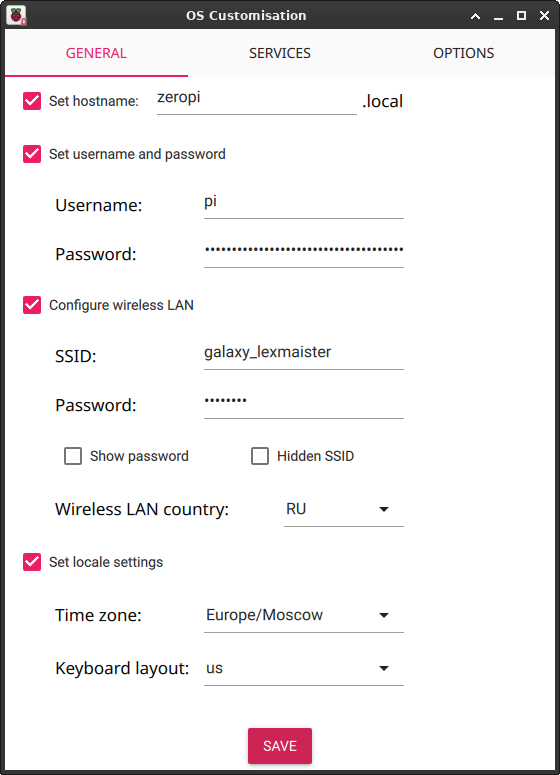

# Wildlife camera

Wildlife camera project based on Raspberry Pi Zero W with 5Mp Camera and PIR motion sensor.

## Raspberry Pi Zero W setup

### Flasing RPi OS

The most straight way to prepare SD-card is ising `rpi-imager`. It can be installed with:
```sh
sudo apt install rpi-imager
```

Due to Zero Pi will used with battery power source and without display, it is more efficient to use Raspberry Pi OS Lite:
* Text-only operating system. 
* No graphical desktop, fewer background processes.
* Consumes less power, boots faster, less load on CPU and RAM.


Using `rpi-imager` allows to initially set up our system to use `ssh` and put credentials to connect to wi-fi network after first boot, so board will be accessible via ssh:




### Connect to board - setup USB gadget

After flashing, insert your SD card to Zero Pi and wait for about 1 minute while it's booting. You also can check router info to wait until Zero Pi connects to it.

Then it should be accessible to connect to with ssh:
```sh
ssh pi@zeropi.local
```

Then you can setup USB-gadget mode to connect with terminal.
In Zero Pi console:
```sh
echo "dtoverlay=dwc2" | sudo tee -a /boot/firmware/config.txt 
echo " modules-load=dwc2,g_serial" | sudo tee -a /boot/firmware/cmdline.txt
# reboot
sudo reboot
```

After reboot - check if serial device is available
```sh
ls /dev/ttyGS0
sudo systemctl is-active getty@ttyGS0.service
```

Now you can connect to Zero Pi via USB cable (plug it into `USB` connector on board) with terminal utility such as `picocom`:
```sh
# check which serial device is used on your machine
sudo dmesg | grep tty
# example output: [ 4719.975580] cdc_acm 3-1:2.0: ttyACM0: USB ACM device
picocom /dev/ttyACM0 -b 115200
```

### Setup and check camera

For using as wildlife camera it is nessesary to turn of the camera led (in Zero Pi console):
```sh
echo "disable_camera_led=1" | sudo tee -a /boot/firmware/config.txt 
```

Then check if camera can grab images on full resolution with [built-in camera software](https://www.raspberrypi.com/documentation/computers/camera_software.html)
```sh
# available cameras
rpicam-still --list-cameras
```

output should be like:
```
Available cameras
-----------------
0 : ov5647 [2592x1944 10-bit GBRG] (/base/soc/i2c0mux/i2c@1/ov5647@36)
    Modes: 'SGBRG10_CSI2P' : 640x480 [58.92 fps - (16, 0)/2560x1920 crop]
                             1296x972 [46.34 fps - (0, 0)/2592x1944 crop]
                             1920x1080 [32.81 fps - (348, 434)/1928x1080 crop]
                             2592x1944 [15.63 fps - (0, 0)/2592x1944 crop]
```

Get full resolution test image:
```sh
rpicam-still -n --width 2592 -o test.jpg
```

Test image should appear in `/home/pi` directory.

<!-- Previously you shold install `vlc` and codecs and streaming:
```sh
sudo apt update
sudo apt install vlc-bin ffmpeg
``` -->

Next test - 5 seconds video clip with FullHD resolution:
```sh
rpicam-vid -n -t 5s --width 1980 --height 1080 -o test.h264
```

Copy this files to your PC and check if they were recorded properly. To watch `.h264` video you can use:
```sh
ffplay test.h264
```

## Setup video streaming

[TCP streaming](https://www.raspberrypi.com/documentation/computers/camera_software.html#stream-video-over-a-network-with-rpicam-apps) will be used for pointing and aiming the camera.

### Uncapsulated H264

Zero Pi as server:
```sh
rpicam-vid -t 0 -n --inline --listen -o tcp://0.0.0.0:8888
```

On client side - to view video:
```sh
ffplay tcp://zeropi.local:8888 -vf "setpts=N/((25)*TB)" -fflags nobuffer -flags low_delay -framedrop
```

### MPEG

Run server:
```sh
rpicam-vid -t 0 -n --codec mjpeg --listen -o tcp://0.0.0.0:8888
```

On client side - PC `VLC`:
```sh
vlc tcp/mjpeg://<ZEROPI_IP_ADDRESS>:8888
```

On Android with `VLC`: 
* Open `VLC`
* Add new stream: `tcp://<ZEROPI_IP_ADDRESS>:8888`

## PIR sensor

[Comprehensive guide](https://learn.adafruit.com/pir-passive-infrared-proximity-motion-sensor/overview) to PIR sensor work principles, design and usage. Sensor settings for this project:
* the jumper is in the `H position`,
* `time` is minimal,
* `sensetivity` is medium.

**Connect to Zero Pi**

To connect PIR sensor to Zero Pi we'll use the `J8` connector:


Sensor should be connected to the following pins:
* 1 - `3.3 VDC`
* 9 - `Ground`
* 11 - `GPIO 17` - sensor's `Out` signal

## System setup

Install libraries and git:
```sh
sudo apt update
sudo apt install python3-picamera2 --no-install-recommends
sudo apt install git
```

Clone project from GitHub:
```sh
git clone git clone https://github.com/lexmaister/wildlife_camera.git
cd wildlife_camera/scripts/ 
```

Then make the scripts executable:
```sh
chmod +x *.sh *.py
```

Now you can check if PIR-sensor is working - run script and move a palm ahead of it:
```sh
./pir_check.py
```

If it works, script should print `Motion detected!` and then close.

## Start capturing

Run script to start video streaming, connect to the camera with `vlc` and point it:
```sh
./lv_stream.sh
```

After aiming, run capturing with command (options are available):
```sh
./rwc_start.py

usage: rwc_start.py [-h] [-m MODE] [-d N]

Capture wonderful moments of life in the wild nature with Raspberry Pi
Wildlife Camera

options:
  -h, --help            show this help message and exit
  -m MODE, --mode MODE  Capture mode [snapshot, clip], default: clip
  -d N, --duration N    Clip duration in seconds, default: 10
```
